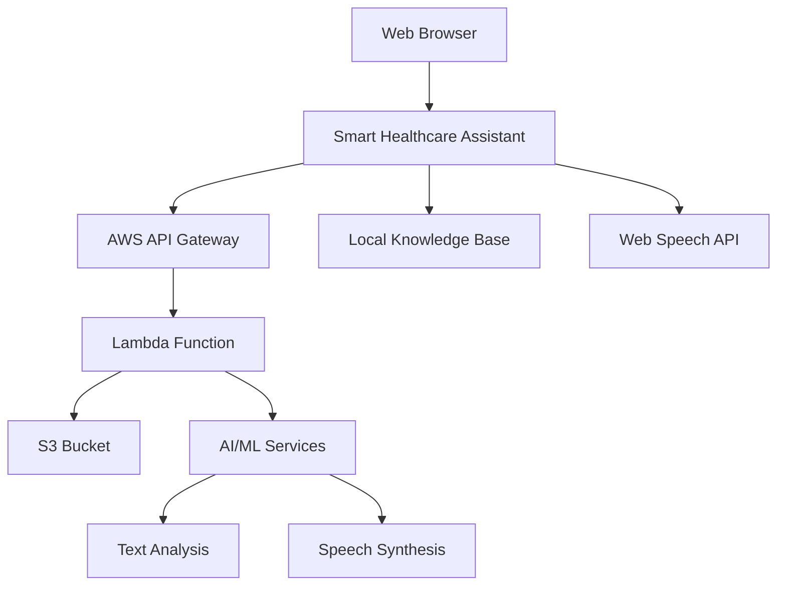

# 🏥 Smart Healthcare Assistant

> **A modern, AI-powered healthcare assistant that processes medical documents and provides instant medical guidance through an intuitive web interface.**

## 🌟 Overview

The Smart Healthcare Assistant is a comprehensive web application designed to revolutionize healthcare information access. It combines cutting-edge AWS cloud services with an intuitive user interface to provide:

- **PDF Medical Document Processing**: Upload medical reports, lab results, or research papers for instant analysis
- **AI-Powered Summarization**: Get concise, medically-accurate summaries with audio playback
- **Specialist Recommendations**: Receive targeted specialist suggestions based on document content
- **Interactive Medical Assistant**: Chat with a local knowledge base for quick medical queries
- **Accessibility Features**: Voice input, text-to-speech, and responsive design for all users

## ✨ Key Features

### 🔬 **Medical Document Analysis**
- **PDF Upload & Processing**: Secure cloud-based document analysis
- **Intelligent Summarization**: AI-generated medical summaries
- **Audio Synthesis**: Text-to-speech for accessibility
- **Specialist Matching**: Smart recommendations based on medical content
- **Report Download**: Save summaries as text files

### 💬 **Interactive Medical Assistant**
- **Instant Medical Queries**: Real-time responses to health questions
- **Comprehensive Knowledge Base**: 40+ common medical conditions and symptoms
- **Voice Recognition**: Hands-free interaction (Chrome/Edge)
- **Speech Synthesis**: Audio responses for all interactions
- **Smart Suggestions**: Quick-access buttons for common queries

### 🎨 **Modern User Interface**
- **Glass Morphism Design**: Professional, medical-grade appearance
- **Smooth Scrolling**: Seamless navigation with progress indicators
- **Responsive Layout**: Perfect on desktop, tablet, and mobile
- **Accessibility First**: High contrast, large fonts, keyboard navigation
- **Interactive Elements**: Hover effects, smooth animations, and transitions

### 🌐 **Advanced Web Features**
- **Progressive Enhancement**: Works offline for basic functionality
- **Smooth Navigation**: Floating navigation with section jumping
- **Scroll Management**: Auto-scrolling, back-to-top, progress tracking
- **Browser Compatibility**: Optimized for all modern browsers

## 🖼️ Demo & Screenshots

### Main Interface
```
┌─────────────────────────────────────────────────────────────┐
│  🏥 Smart Healthcare Assistant                              │
│                                                             │
│  📄 Upload Medical PDF        💬 Chat Assistant            │
│  ┌─────────────────┐         ┌─────────────────┐            │
│  │ [Choose File]   │         │ Hello! I'm your │            │
│  │ Upload & Process│         │ medical assist. │            │
│  └─────────────────┘         │                 │            │
│                              │ Type: "fever"   │            │
│  📋 Medical Summary          │ [Send] 🎤 🔊   │            │
│  ┌─────────────────┐         └─────────────────┘            │
│  │ Summary details │                                        │
│  │ with audio play │         💡 Tip: Use the chat for       │
│  └─────────────────┘            quick medical checks        │
└─────────────────────────────────────────────────────────────┘
```

## 🚀 Quick Start

### Prerequisites
- Modern web browser (Chrome 90+, Firefox 88+, Safari 14+, Edge 90+)
- Internet connection for AWS services
- Microphone (optional, for voice input)

### Installation

1. **Clone the Repository**
   ```bash
   git clone https://github.com/DEVANAND-JAYARAMAN/SmartHealthcareAssistant_AWS.git
   cd SmartHealthcareAssistant_AWS
   ```

2. **Open the Application**
   ```bash
   # Option 1: Direct browser opening
   open index.html
   
   # Option 2: Local server (recommended)
   python -m http.server 8000
   # or
   npx serve .
   ```

3. **Access the Application**
   - Direct: Open `index.html` in your browser
   - Server: Navigate to `http://localhost:8000`

### First-Time Setup
1. **Test the Chat Assistant**: Type "fever" and press Send
2. **Try Voice Features**: Click 🎤 for voice input, 🔊 for audio responses
3. **Upload a PDF**: Test with any medical document (requires AWS backend)

## 🏗️ Architecture



### Technology Stack
- **Frontend**: HTML5, CSS3, JavaScript ES6+
- **Cloud**: AWS Lambda, S3, API Gateway
- **AI/ML**: AWS Polly (Text-to-Speech), Custom NLP
- **Storage**: Amazon S3 for document processing
- **APIs**: Web Speech API, Fetch API

## 📁 File Structure

```
SmartHealthcareAssistant_AWS/
├── 📄 index.html              # Main application file (all-in-one)
├── 🎨 styles.css              # Enhanced styling and responsive design
├── 🧠 medical_kb.js           # Medical knowledge base (40+ conditions)
├── 📖 README.md               # This documentation file
└── 🖼️ assets/                 # (Optional) Images and media files
```

### Core Files Explained

#### `index.html` - Main Application
- **UI Components**: Upload interface, chat system, summary display
- **JavaScript Logic**: File processing, API calls, speech features
- **Styling**: Embedded CSS for glass morphism and animations
- **Responsive Design**: Mobile-first responsive layout

#### `styles.css` - Enhanced Styling
- **Glass Morphism**: Modern UI with backdrop blur effects
- **Responsive Grid**: Flexible layout for all screen sizes
- **Smooth Animations**: CSS transitions and keyframe animations
- **Accessibility**: High contrast, large fonts, focus indicators

#### `medical_kb.js` - Knowledge Base
- **Medical Conditions**: 40+ common health conditions
- **Symptom Mapping**: Keyword-based response system
- **Treatment Guidance**: Basic medical advice and recommendations
- **Emergency Indicators**: When to seek immediate medical attention

## 📚 Usage Guide

### 1. Medical Document Processing

#### Uploading Documents
```javascript
// Supported formats: PDF
// Max file size: 10MB (configurable)
// Processing time: 10-30 seconds
```

1. Click **"Choose File"** and select your PDF
2. Click **"Upload & Process"** 
3. Wait for processing (status updates shown)
4. View generated summary and audio

#### Understanding Results
- **📋 Medical Summary**: Key findings and important information
- **🩺 Specialist Recommendation**: Suggested medical specialist
- **🔊 Audio Playback**: Listen to the summary
- **📄 Download Report**: Save summary as text file

### 2. Interactive Medical Assistant

#### Starting a Conversation
```javascript
// Example queries:
"What are the symptoms of diabetes?"
"How to treat a fever?"
"Normal blood pressure ranges"
"COVID-19 symptoms"
```

#### Voice Features
- **🎤 Voice Input**: Click microphone icon, speak your question
- **🔊 Speech Output**: All responses are read aloud automatically
- **Re-play**: Click speaker icon to repeat last response

#### Quick Suggestions
Use the suggestion buttons for common queries:
- **fever** - Information about fever management
- **blood pressure** - Blood pressure guidelines
- **diabetes** - Diabetes symptoms and management

### 3. Navigation Features

#### Smooth Scrolling
- **Floating Navigation**: Appears after scrolling 100px
- **Section Jumping**: Quick access to Upload, Summary, Chat
- **Back to Top**: Return to top of page
- **Scroll Progress**: Visual progress bar at top

#### Keyboard Shortcuts
- **Page Up/Down**: Smooth scrolling through content
- **Ctrl+Home**: Jump to top of page
- **Ctrl+End**: Jump to bottom of page
- **Enter**: Send message in chat
- **Tab**: Navigate through interactive elements

## 🔗 API Integration

### AWS Backend Setup

#### Required AWS Services
```yaml
Services:
  - API Gateway: RESTful API endpoint
  - Lambda: Document processing function
  - S3: File storage and delivery
  - Polly: Text-to-speech synthesis (optional)
  - IAM: Security and permissions
```

#### API Endpoint Configuration
```javascript
// In index.html, update the API endpoint:
const API_ENDPOINT = "https://your-api-gateway-url/prod/submit-pdf";

// Expected response format:
{
  "statusCode": 200,
  "summary_text": "Medical summary content...",
  "recommended_specialist": "Cardiologist",
  "recommendation_reason": "Based on cardiovascular indicators",
  "audio_s3_url": "https://s3.amazonaws.com/bucket/audio.mp3"
}
```

#### Lambda Function Structure
```python
def lambda_handler(event, context):
    # Process uploaded PDF
    # Generate medical summary
    # Create audio file
    # Return structured response
    pass
```

### Local Development

#### Mock API Response
```javascript
// For testing without backend:
const mockResponse = {
  summary_text: "Sample medical summary...",
  recommended_specialist: "General Practitioner",
  recommendation_reason: "For routine health check",
  audio_s3_url: "path/to/sample-audio.mp3"
};
```

## 🌐 Browser Compatibility

### Fully Supported Browsers
- **Chrome 90+**: Full feature support including voice recognition
- **Firefox 88+**: All features except voice input
- **Safari 14+**: All features with limited voice support
- **Edge 90+**: Full feature support including voice recognition

### Feature Support Matrix
| Feature | Chrome | Firefox | Safari | Edge |
|---------|--------|---------|--------|------|
| PDF Upload | ✅ | ✅ | ✅ | ✅ |
| Chat Assistant | ✅ | ✅ | ✅ | ✅ |
| Text-to-Speech | ✅ | ✅ | ✅ | ✅ |
| Voice Recognition | ✅ | ❌ | ⚠️ | ✅ |
| File Download | ✅ | ✅ | ✅ | ✅ |
| Smooth Scrolling | ✅ | ✅ | ✅ | ✅ |

### Mobile Support
- **iOS Safari**: Full functionality on iPad/iPhone
- **Android Chrome**: Complete feature support
- **Mobile Edge**: Full compatibility
- **Responsive Design**: Optimized for all screen sizes

## 🎨 Customization

### Theme Customization
```css
/* In styles.css, modify CSS variables */
:root {
  --primary-color: #4a90e2;      /* Main accent color */
  --secondary-color: #10b981;    /* Success/medical color */
  --background: #071029;         /* Main background */
  --glass: rgba(255,255,255,0.06); /* Glass effect opacity */
}
```

### Medical Knowledge Base
```javascript
// In medical_kb.js, add new medical conditions:
{
  q: ['condition', 'symptom', 'keywords'],
  a: 'Detailed medical response with guidance...'
}
```

### UI Layout
```css
/* Modify container layout in styles.css */
.container {
  grid-template-columns: 1fr 380px; /* Adjust column sizes */
  max-width: 1020px;               /* Container max width */
}
```

## 🔧 Troubleshooting

### Common Issues

#### PDF Upload Fails
```
Issue: Upload returns error
Solutions:
- Check API endpoint configuration
- Verify file size (max 10MB)
- Ensure PDF is not password-protected
- Check browser console for errors
```

#### Voice Features Not Working
```
Issue: Microphone/speaker icons not functioning
Solutions:
- Use Chrome or Edge browser
- Allow microphone permissions
- Check device audio settings
- Ensure HTTPS connection (required for voice)
```

#### Layout Issues
```
Issue: UI elements overlapping or misaligned
Solutions:
- Clear browser cache and reload
- Check browser zoom level (100% recommended)
- Update to latest browser version
- Disable browser extensions
```

#### Slow Performance
```
Issue: Application feels sluggish
Solutions:
- Disable background animations in CSS
- Close unnecessary browser tabs
- Check internet connection speed
- Use Chrome or Edge for best performance
```

### Debug Mode
```javascript
// Enable debug logging in browser console:
localStorage.setItem('debug', 'true');
// Reload page to see detailed logs
```

## 🤝 Contributing

We welcome contributions to improve the Smart Healthcare Assistant! Here's how you can help:

### Development Setup
```bash
# 1. Fork the repository
# 2. Clone your fork
git clone https://github.com/your-username/SmartHealthcareAssistant_AWS.git

# 3. Create a feature branch
git checkout -b feature/your-feature-name

# 4. Make your changes
# 5. Test thoroughly
# 6. Commit and push
git commit -m "Add your feature description"
git push origin feature/your-feature-name

# 7. Create a Pull Request
```

### Contribution Areas
- **🏥 Medical Knowledge**: Expand the medical knowledge base
- **🎨 UI/UX**: Improve design and user experience
- **♿ Accessibility**: Enhance accessibility features
- **🌐 Internationalization**: Add multi-language support
- **📱 Mobile**: Improve mobile responsiveness
- **⚡ Performance**: Optimize loading and runtime performance

### Code Style
- Use ES6+ JavaScript features
- Follow CSS BEM methodology
- Write descriptive commit messages
- Include comments for complex logic
- Test on multiple browsers

## 📄 License

This project is licensed under the MIT License - see the [LICENSE](LICENSE) file for details.

```
MIT License

Copyright (c) 2025 Devanand Jayaraman

Permission is hereby granted, free of charge, to any person obtaining a copy
of this software and associated documentation files (the "Software"), to deal
in the Software without restriction, including without limitation the rights
to use, copy, modify, merge, publish, distribute, sublicense, and/or sell
copies of the Software, and to permit persons to whom the Software is
furnished to do so, subject to the following conditions:

The above copyright notice and this permission notice shall be included in all
copies or substantial portions of the Software.

THE SOFTWARE IS PROVIDED "AS IS", WITHOUT WARRANTY OF ANY KIND, EXPRESS OR
IMPLIED, INCLUDING BUT NOT LIMITED TO THE WARRANTIES OF MERCHANTABILITY,
FITNESS FOR A PARTICULAR PURPOSE AND NONINFRINGEMENT. IN NO EVENT SHALL THE
AUTHORS OR COPYRIGHT HOLDERS BE LIABLE FOR ANY CLAIM, DAMAGES OR OTHER
LIABILITY, WHETHER IN AN ACTION OF CONTRACT, TORT OR OTHERWISE, ARISING FROM,
OUT OF OR IN CONNECTION WITH THE SOFTWARE OR THE USE OR OTHER DEALINGS IN THE
SOFTWARE.
```

## ⚠️ Medical Disclaimer

**IMPORTANT**: This application is for educational and informational purposes only. It is not intended to be a substitute for professional medical advice, diagnosis, or treatment. Always seek the advice of your physician or other qualified health provider with any questions you may have regarding a medical condition. Never disregard professional medical advice or delay in seeking it because of something you have read in this application.

The medical information provided by this assistant is based on general knowledge and should not be used for self-diagnosis or treatment decisions. In case of a medical emergency, please contact your local emergency services immediately.

---

## 🙏 Acknowledgments

- **AWS Services**: For providing robust cloud infrastructure
- **Web Speech API**: For enabling voice interactions
- **Medical Community**: For guidance on healthcare best practices
- **Open Source**: Built with open web standards and technologies

## 📞 Support & Contact

- **Issues**: [GitHub Issues](https://github.com/DEVANAND-JAYARAMAN/SmartHealthcareAssistant_AWS/issues)
- **Discussions**: [GitHub Discussions](https://github.com/DEVANAND-JAYARAMAN/SmartHealthcareAssistant_AWS/discussions)
- **Email**: [devanand3254@gmail.com](mailto:devanand3254@gmail.com)

---

<div align="center">

**🏥 Smart Healthcare Assistant - Making Healthcare Information Accessible to Everyone**

---

Made with ❤️ for better healthcare accessibility

**Copyright © 2025 Dev Anand Jayaraman. All rights reserved.**


</div>


